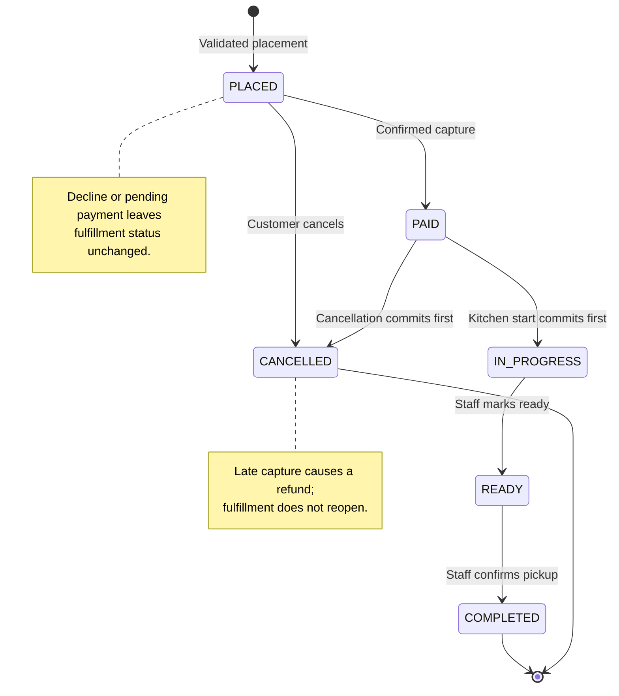
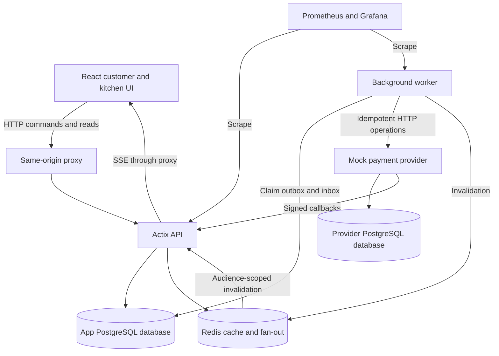
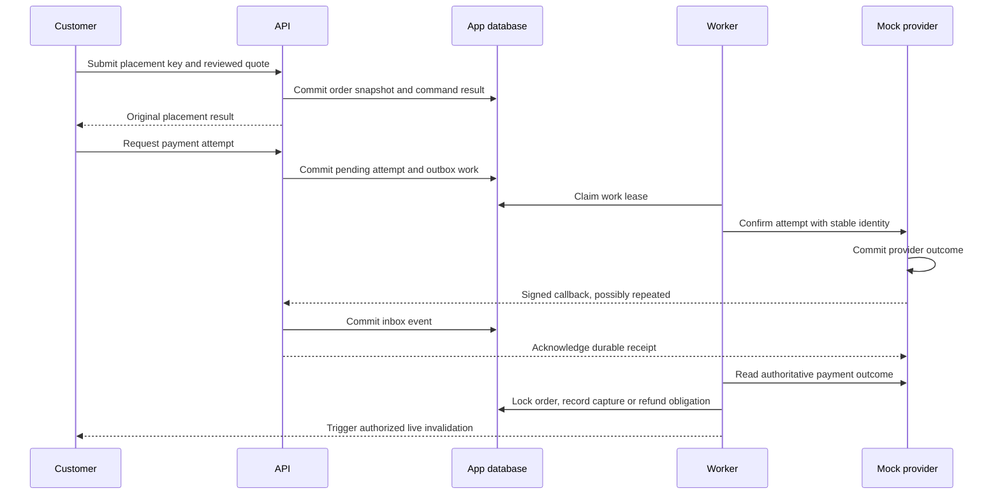
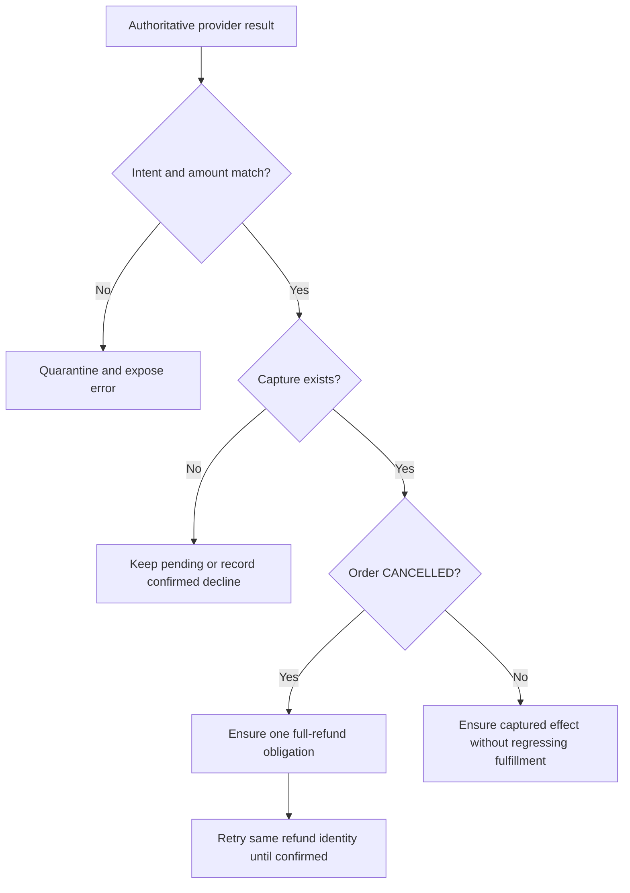
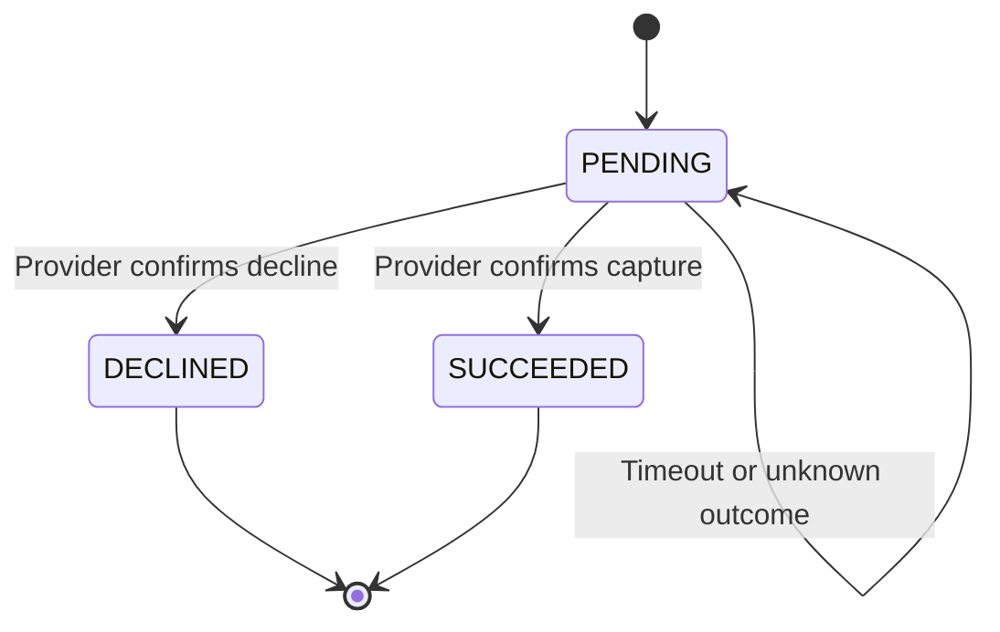

# Mock Food Ordering Loop - Plan

## Goal Capsule

- **Objective:** Customers can place and track pickup orders, and restaurant staff can fulfill them, with consistent outcomes when payment messages, requests, or live connections fail or repeat.
- **Means:** A modular monolith with a background worker, durable order records, a Stripe-shaped payment mock, and server-sent events.
- **Product authority:** The user-confirmed ordering-loop scope recorded in this Product Contract. Admin analytics and other surrounding features are not active scope.
- **Authority:** Product behavior is owned by R-IDs; implementation mechanisms are owned by KTD-IDs within those constraints. Units and examples do not override either.
- **Execution direction:** Prove monetary and concurrency invariants against PostgreSQL before browser integration.
- **Stop conditions:** Stop for a required scope change, weakened monetary invariant, or unavailable benchmark resources; report the limitation rather than claiming completion.
- **Tail ownership:** Implementation owns verification, documentation, and cleanup. No remote repository or deployment destination is configured; publishing is not part of this plan.
- **Open blockers:** None to start implementation. Capacity remains unverified until the Verification Contract is met.

---

## Product Contract

### Summary

Build a seeded, multi-restaurant pickup ordering demo with configurable menu options, calculated checkout totals, payment simulation, a restaurant work queue, and live customer tracking.
The demo must demonstrate safe retries and recovery as well as the successful ordering path.

### Problem Frame

A useful payment-integration demo must expose the failures hidden by a successful checkout: lost responses, repeated callbacks, concurrent kitchen actions, and disconnected customers. The requested peak traffic also makes correctness and measured capacity separate concerns.

### Key Decisions

- **Ordering loop first.** Focus on a complete customer-to-kitchen outcome before reporting features. Governs R1, R21. (session-settled: user-directed — chosen over including admin analytics immediately: analytics can follow once order history exists.)
- **Pickup fulfillment.** Avoid delivery and scheduling rules in the initial workflow. Governs R1, R13. (session-settled: user-approved — chosen over broader fulfillment: ASAP pickup provides a bounded first version.)
- **Cancellation cutoff.** Protect kitchen work once preparation begins. Governs R14, R15. (session-settled: user-directed — chosen over cancellation until READY: cancellation closes before preparation starts.)
- **Availability instead of stock reservations.** Model whether an item can be ordered without inventory allocation. Governs R4, R7. (session-settled: user-directed — chosen over tracked quantities: avoid reservation expiry and overselling rules in the initial demo.)
- **Demo identity shortcut.** Exercise separate roles without building signup or credential management. Governs R3. (session-settled: user-directed — chosen over seeded email/password login: identity selection is sufficient for this mock.)
- **Tax and restaurant fees.** Retain realistic checkout totals while using a single seeded tax region. Governs R8, R9. (session-settled: user-directed — chosen over item-only totals: include regional tax and restaurant-specific service fees.)
- **Untaxed service fee.** Keep the two percentage calculations independent in the mock. Governs R9. (session-settled: user-approved — chosen over taxing the fee: use the proposed subtotal-only tax basis.)
- **Notifications while the app is open.** Keep background browser delivery outside the first version. Governs R18. (session-settled: user-approved — chosen over closed-browser Web Push: app-open delivery is sufficient.)
- **Modular monolith with a worker.** Keep order and payment consistency together while allowing background work to run separately. Governs R20. (session-settled: user-approved — chosen over separate order/payment/notification services: fewer cross-service failure modes and deployments.)
- **SSE for server updates.** Keep commands on HTTP and use a one-way stream for notifications. Governs R17. (session-settled: user-approved — chosen over WebSockets: current live traffic is server-to-browser.)

<!-- ce-section: work-relationships -->
### How This Work Fits Together

This plan owns the ordering loop. The broader breakdown is the current understanding, not a committed roadmap.

- **Admin analytics:** Depends on order history from this loop; future measures include user spending, completion time, and restaurant sales.
- **Restaurant dashboards:** Depend on order history and share restaurant access boundaries; restaurant-specific analytics remain a later feature.
- **Signup:** Extends the seeded identity and restaurant model; customer and restaurant onboarding need separate scope.
- **Additional notification channels:** Share order lifecycle events; SMS simulation and closed-browser delivery can be designed separately.

### Actors

- A1. **Customer:** A seeded user who browses menus, places orders, pays through the mock, tracks progress, and cancels eligible orders.
- A2. **Restaurant staff:** A seeded user assigned to a restaurant who views its queue, controls item availability, and advances its paid orders.
- A3. **Demo admin:** A seeded app-wide identity for viewing operational data; analytics dashboards are deferred.
- A4. **Mock payment provider:** Simulates payment results and callbacks independently from the browser request.
- A5. **Background processor:** Delivers durable work and retries payment-related and notification processing.

### Requirements

**Seed data and access**

- R1. Orders are ASAP pickup orders containing items from exactly one restaurant.
- R2. Seed 5–10 users, 3–5 restaurants, and 5–20 menu items per restaurant, with representative options, availability states, and fee configurations.
- R3. A demo account picker establishes the selected identity, and the backend enforces customer ownership, staff restaurant assignment, and admin app-wide read access across HTTP responses and live streams.

**Menu and checkout**

- R4. Customers can browse restaurants and menus, while assigned staff can toggle an item's available/sold-out state without tracking stock quantities.
- R5. Item configuration supports required single-choice groups, optional extras with price adjustments, and positive whole-number quantities.
- R6. A customer reviews the complete calculated total before submitting an order.
- R7. The server validates the restaurant, items, quantities, options, availability, and current checkout amounts at placement, requiring renewed customer review when displayed pricing has changed and blocking unavailable items.
- R8. Tax is configured by region, with one shared seeded region, and each restaurant has a nullable service-fee percentage constrained to 0–3% inclusive.
- R9. The item subtotal includes selected extras multiplied by quantities; tax and service fee are calculated independently on that subtotal, rounded separately to cents, and added to it, with a null fee treated as zero.
- R10. Placed orders preserve item and option names, quantities, unit prices, tax/fee rates, and monetary amounts so later menu or configuration edits cannot alter their totals.

**Order and payment correctness**

- R11. Retrying the same order-placement intent returns the original order rather than creating another, while reuse of its idempotency key with different order input is rejected.
- R12. Payment simulation supports success, decline, delayed success, and duplicate callbacks, allowing a declined order to be retried and showing an unresolved attempt as payment confirmation pending.
- R13. The forward order lifecycle is PLACED → PAID → IN_PROGRESS → READY → COMPLETED, with only confirmed payment establishing PAID and assigned staff controlling subsequent transitions through pickup handoff.
- R14. Customers can cancel their own orders only in PLACED or PAID, with competing cancellation and kitchen-start actions resolved by the first committed valid transition.
- R15. Cancellation refunds the complete captured amount through the mock, and a capture confirmed after cancellation triggers a refund while the order remains CANCELLED.
- R16. Repeated requests, callbacks, and background attempts must not duplicate successful capture, refund, or order-state effects, and delayed or out-of-order results must not regress a terminal order.

The lifecycle below illustrates R13–R16. Payment attempts and refund progress are separate facts from order fulfillment status; a cancelled order may still have a refund pending.



**Live tracking and restaurant operations**

- R17. Customers and restaurant staff receive authorized live updates through SSE, and reconnecting or recovering from missed events restores authoritative state without stale messages rolling the UI backward.
- R18. READY produces an in-app indication and, when browser permission allows, a browser notification while the app is open, with an in-app fallback when permission is denied or unavailable.
- R19. The restaurant queue makes newly paid orders actionable and exposes their items, customizations, quantities, age, and current status, with only valid next actions available.

**Architecture and operability**

- R20. Use a modular backend codebase with separate API and worker processes, PostgreSQL as durable authority, and a transactional outbox for work arising from committed order/payment changes; Redis caching or live distribution must not determine monetary correctness.
- R21. Collect operational errors and metrics sufficient to diagnose request failures, payment outcomes, duplicate suppression, outbox retries/backlog, refund progress, and live-update recovery.
- R22. Provide an OSS-oriented local service environment managed with Docker, with reproducible sample data and no dependency on real payment credentials or real charges.

**UI direction**

- R23. Customer ordering and tracking prioritize phone use with a warm, friendly tone; restaurant operations prioritize tablet/desktop use with a restrained, utilitarian tone following the selected Hallmark direction.
- R24. Checkout and tracking visibly distinguish loading, validation failure, payment decline, payment pending, cancellation, and refund pending/completed, while kitchen actions recover clearly from rejected concurrent updates.
- R25. Interactive screens support keyboard use, visible focus, readable status labels beyond color alone, narrow-screen layouts, and reduced motion.

### Key Flows

- F1. **Browse and place.** Covers R1–R11, R23–R25. A1 selects a restaurant, configures items, adjusts quantity, reviews the total, and submits; server validation produces an immutable order or an actionable checkout correction.
- F2. **Confirm payment.** Covers R12, R13, R16, R24. A1 uses a mock scenario; A4 delivers the result; the customer sees decline/pending or confirmed payment, and A2 can act only after confirmation.
- F3. **Prepare and collect.** Covers R13, R17–R19. A2 starts a paid order, marks it ready, and confirms pickup; A1 tracks progress and receives the READY indication.
- F4. **Cancel and reconcile.** Covers R14–R16, R24. A1 cancels an eligible order; A5 reconciles captured money with the mock, including a late successful capture, without reopening fulfillment.
- F5. **Reconnect and recover.** Covers R3, R16–R18, R21. A1 or A2 reconnects after interruption, recovers current authorized state, and continues without stale status or duplicate business effects.

UI organization is directional rather than a finished layout: customer surfaces comprise restaurant discovery, a restaurant menu with item configuration and cart, checkout/payment, and order tracking. The staff surface centers on the active queue and selected order details. The account picker remains visibly a demo control, not an administrative permission bypass. This composition implements F1–F5 and R23–R25; typography, palette, and component placement remain design work.

### Acceptance Examples

| Example | Covers | Given / When | Expected result |
| --- | --- | --- | --- |
| AE1. Normal pickup | R1, R5, R6, R9, R12, R13, R19 | Customer configures an item, pays successfully, and staff completes preparation and pickup. | Correct reviewed total is preserved; order follows the forward lifecycle and ends COMPLETED. |
| AE2. Retried placement | R11 | An order is committed but its response is lost; customer retries with the same key and input. | Original order is returned and no second order is created. |
| AE3. Changed idempotent input | R11 | The same placement key is reused with different quantity or options. | Reuse is rejected without creating or changing an order. |
| AE4. Duplicate capture callback | R12, R16 | A successful payment callback arrives repeatedly. | One successful capture and one resulting payment effect are recorded. |
| AE5. Decline and retry | R12, R13, R16, R24 | A payment declines, then customer retries successfully. | The same order remains retryable and becomes PAID once; kitchen cannot start it during the decline. |
| AE6. Delayed confirmation | R12, R13, R16, R24 | Payment remains unresolved and customer repeats the action. | Pending state remains visible; repetition does not create another successful capture or expose premature kitchen action. |
| AE7. Cancel before payment | R14, R15 | Customer cancels an unpaid order and no capture occurs. | Order becomes CANCELLED with no refund owed. |
| AE8. Cancel after capture | R14–R16, R24 | Customer cancels PAID before kitchen start. | Fulfillment stops; full total is refunded once, with pending versus completed refund visible. |
| AE9. Late capture after cancellation | R15, R16 | A delayed success arrives after cancellation has committed. | Order stays CANCELLED; full captured total is refunded once. |
| AE10. Cancellation/start race | R13, R14 | Customer cancellation and staff start contend on the same PAID order. | First committed transition wins; losing action receives current state, and no order is simultaneously cancelled and in preparation. |
| AE11. Closed cancellation window | R13, R14 | Customer attempts cancellation after IN_PROGRESS, READY, or COMPLETED. | Cancellation is rejected and fulfillment state is unchanged. |
| AE12. Changed menu before placement | R6, R7 | Menu pricing changes or an item sells out after the customer reviewed it. | Changed amount requires renewed review; sold-out item blocks placement. |
| AE13. Historical price stability | R8–R10 | Menu price, tax rate, or restaurant fee changes after placement. | Existing order and any refund retain the original recorded amounts. |
| AE14. Independent percentages | R8, R9 | Illustrative fixture: $20.00 subtotal, 8% mock tax, 3% fee. | Tax is $1.60, fee is $0.60, total is $22.20; the fee is not taxed. The 8% rate is test data, not a jurisdictional claim. |
| AE15. Fee limits | R8, R9 | Fee is null, zero, exactly 3%, negative, or greater than 3%. | Null and zero add nothing, 3% is accepted, and negative or above-cap settings are rejected. |
| AE16. Invalid selection | R1, R5, R7 | Required choice is missing, quantity is invalid, or items/options belong to another restaurant. | Placement fails without charging or creating a payable order. |
| AE17. Lost live connection | R17, R18 | Customer misses READY while disconnected, then reconnects with the app open. | Tracking restores current state and visibly indicates readiness when current state is READY; stale events do not regress later states. |
| AE18. Notification denied | R18 | Browser notifications are unavailable or permission is denied when READY arrives. | In-app readiness remains visible and the order flow continues. |
| AE19. Access boundary | R3 | Customer requests another user's order or staff requests another restaurant's queue/stream. | Access is denied for both reads and live delivery. |
| AE20. Worker interruption | R15, R16, R20, R21 | Worker stops after a durable change or after sending a side effect but before recording delivery. | Work remains recoverable; retry does not duplicate monetary effects and backlog/retry progress is observable. |
| AE21. Terminal-state protection | R13, R16 | A stale payment or status message arrives after COMPLETED or CANCELLED. | Fulfillment never reopens; any late capture on a cancelled order follows AE9. |
| AE22. Stale cached menu | R7, R10, R20 | Customer sees cached data older than a committed availability or price change. | Placement enforces authoritative data and any existing order remains unchanged. |

### Success Criteria

- Demonstrate F1–F5 and AE1–AE22 using repeatable seeded scenarios, including failure/retry paths rather than only scripted success.
- Benchmark a peak workload of **100 order placements per second**, not 100 total HTTP requests per second, with a **50:1 read-to-write traffic ratio** and payment callbacks, status writes, and SSE activity represented.
- State the denominator for the benchmark ratio: approximately 5,000 reads/second is only the placement-based baseline, and counting all write requests requires additional reads to preserve 50:1.
- Publish achieved throughput, latency distributions, error rates, live-update lag, backlog behavior, hardware/resource limits, and workload composition; do not claim the target was met from framework or serializer selection alone.
- Recovery demonstrations preserve all monetary and lifecycle invariants under interrupted requests, worker restarts, repeated callbacks, and reconnected clients.

### Scope Boundaries

- Admin spending/sales/completion-time analytics and restaurant-specific reporting dashboards are deferred; R21 covers operational telemetry only.
- Customer and restaurant signup, credential-based login, and production identity onboarding are deferred; R3 defines the initial shortcut.
- Delivery, scheduled orders, and multi-restaurant checkout are outside this version per R1.
- Stock counts, stock reservations, and reservation expiry are deferred per R4.
- Real payment processing, real refunds, SMS, and closed-browser Web Push are deferred per R12, R15, R18.
- Tips, discounts, coupons, and menu-authoring workflows beyond availability toggles are not part of this scope.
- Restaurant/admin cancellation overrides after kitchen start, partial refunds, order amendments after placement, and automatic completion are not included.

### Dependencies / Assumptions

- **Currency:** USD is the retained demo assumption; multi-currency and currency conversion are outside this version.
- **Tax:** Seeded region and rate are configurable mock data, not a representation of a verified legal jurisdiction. Rate selection must be labeled accordingly.
- **Payment boundary:** The mock must retain enough independent provider-side state to distinguish “response lost” from “capture failed”; otherwise retries cannot demonstrate R16 meaningfully.
- **Runtime:** KTD1 resolves the application stack; KTD10 resolves baseline observability. Framework selection is not evidence of achieved capacity.
- **Caching:** Menus change infrequently; exact freshness and invalidation mechanisms are technical choices, subject to R7 and R10.
- **Availability:** Staff availability toggling is the minimal operating control inferred from the accepted toggle-based inventory scope; broader menu and pricing administration is deferred.
- **Order lifetime:** No automatic unpaid-order expiry policy was selected. Preserve the explicit retry/cancel behavior in R12 and R14 rather than introducing timeout-driven cancellation implicitly.
- **Demo identity:** Anyone with access to the picker can select a seeded role, including admin; backend authorization still applies after selection, but the picker is not production authentication.
- **Admin authority:** App-wide read access does not imply unrestricted payment or state-machine overrides.
- **Refund recovery:** A failed or unresolved refund remains visibly pending and observable until retry/reconciliation resolves it; it never restores a cancelled fulfillment state.

### Sources / Research

- [Stripe: idempotent requests](https://docs.stripe.com/api/idempotent_requests?lang=curl) — reference for scoped retry identities and mismatched-parameter handling; the mock must define its own durable guarantees rather than copying retention assumptions unexamined.
- [Stripe: webhook handling](https://docs.stripe.com/webhooks?lang=node) — provider events can duplicate and arrive out of order, motivating R12 and R16.
- [MDN: using server-sent events](https://developer.mozilla.org/en-US/docs/Web/API/Server-sent_events/Using_server-sent_events) — SSE supplies server-to-browser events and reconnect mechanisms, supporting the chosen transport in R17.
- [Redis: Pub/Sub](https://redis.io/docs/latest/develop/pubsub/) — at-most-once delivery is unsuitable as the durable authority for recoverable order/payment work in R20.

---

## Planning Contract

**Product Contract preservation:** R1–R25, A1–A5, F1–F5, and AE1–AE22 unchanged. Added Problem Frame, resolved planning-owned questions into KTDs, and updated the runtime assumption without changing product scope.

### Context and Research

This is a greenfield workspace: only this plan and CodeGraph metadata were present during inspection. CodeGraph returned no relevant application code. There are no existing app manifests, migrations, tests, strategy documents, or captured solutions to reuse. All implementation paths below are proposed additions, not claims about existing files.

### Key Technical Decisions

- KTD1. **Rust backend and TypeScript SPA.** Use Actix Web 4.15.x, SQLx 0.9.x with Tokio/PostgreSQL, and serde-based JSON; React 19.x, Vite 7.x, TanStack Query 5.x, and TanStack Router 1.x provide the client. Pin exact compatible patches, Rust toolchain, Node 22.12+ runtime, and container digests during U1. Avoid CPU-native production build flags; sonic-rs remains a measured follow-up because its optimized build guidance depends on target CPU. Governs R20, R22–R25. [Actix](https://docs.rs/crate/actix-web/4.15.0), [SQLx](https://docs.rs/sqlx/0.9.0/sqlx/), [Vite](https://vite.dev/guide/), [TanStack Query](https://tanstack.dev/query/v5/docs/framework/react/reference/useQuery), [sonic-rs](https://docs.rs/sonic-rs/latest/sonic_rs/).
- KTD2. **One backend package, three entry points.** Keep API, worker, and mock-provider binaries in one Rust package with domain modules and explicit provider adapter boundaries. API and worker use the app database; the mock provider owns a separate database and credentials in the same local PostgreSQL 18 container. Neither app component may query provider tables directly. Redis 8 handles disposable cache and live fan-out. Docker Compose separates core, observability, and benchmark profiles. Governs R12, R16, R20, R22. (session-settled: user-approved — chosen over separate business microservices: retain a modular codebase while testing an independent provider failure boundary.)
- KTD3. **Exact money and authoritative quotes.** Store integer cents and integer basis points, using checked 64-bit arithmetic and wider multiplication intermediates. Use half-up rounding for nonnegative tax/fee amounts. Required choices permit exactly one option per group; optional extras are distinct checkboxes, each at most once per item unit. Allow quantities 1–99, at most 50 cart lines, 20 extras per line, and a $10,000 maximum total. Region fixture is named Demo Region with an explicitly fictional 8% rate. Seed four restaurants with 12 items each and fees null, 0%, 1.5%, and 3%; seed four customers, four staff accounts, and one admin. Governs R1, R2, R5–R10. Limits bound the mock API and are not commercial policy.
- KTD4. **Database constraints and short transactions.** Use SQLx transactions at READ COMMITTED with consistent lock order: restaurant configuration first for checkout, then relevant menu rows in sorted order; order first for all order/payment mutations. Placement shares a lock on restaurant configuration while availability/configuration changes take its exclusive lock, producing a consistent checkout cut. Row locks plus expected order version serialize fulfillment changes. Unique constraints back placement intents, provider intent identity, inbox messages, and monetary effects. No network call occurs inside an app database transaction. Governs R7, R10, R11, R13–R16. [PostgreSQL locking](https://www.postgresql.org/docs/18/explicit-locking.html).
- KTD5. **Durable command identity.** Scope idempotency by actor, operation, and client-generated UUID; store a canonical input digest, resource ID, response status/body, and creation time in the same transaction as the successful command. Retain successful command identities for the lifetime of demo data, including terminal orders. Validation failures do not reserve a key. Concurrent matching commands wait for the winning transaction within the request deadline; a timeout returns retry guidance without claiming failure of the intent. Mismatched input returns conflict. Replays return the original command response; current state is fetched separately. Apply to placement, payment attempts, cancellation, and staff transitions. Governs R11, R14, R16. [Stripe idempotency](https://docs.stripe.com/api/idempotent_requests).
- KTD6. **One provider payment intent per order.** Create/retrieve a provider intent using a durable key derived from the order ID. Distinct attempt identities belong to that intent. Under the order lock, accept the initial attempt only for PLACED and accept later attempts only while still PLACED after provider-confirmed decline of the previous attempt; network timeout remains unresolved and triggers reconciliation of the same attempt. Provider intent row locking and a unique capture constraint permit at most one successful capture for the order, even across attempts. A declined attempt cannot later become successful in the mock contract. Reject new attempts for CANCELLED or any paid/preparing/terminal order. Before issuing unsent capture work, recheck cancellation and suppress it when cancellation is already known; a concurrent in-flight capture still follows R15. Browser responses never establish PAID. Governs R12, R13, R16.
- KTD7. **Signed inbox plus provider reconciliation.** Mock callbacks carry unique event IDs, provider intent/attempt IDs, timestamp, and HMAC signature over timestamp plus raw bytes. Accept signatures within five minutes; retries are freshly signed with the same event ID. Persist authenticated events in an inbox before acknowledging. Inbox workers fetch authoritative provider state outside app transactions, then lock the order and apply monotonic effects. Compare provider version, intent ownership, currency, and amount against the local attempt and snapshot. Reject or quarantine mismatches with observable errors. Cancellation atomically records CANCELLED and any known refund obligation. A later capture on a cancelled order records a full-refund obligation instead of PAID. One refund identity per capture and provider-side uniqueness prevent repeated refunds. Reconcile pending attempts/refunds every 10 seconds so missing callbacks do not strand money. Governs R12–R16, R21, R24. [Stripe webhook guidance](https://docs.stripe.com/webhooks).
- KTD8. **Leased PostgreSQL outbox.** Store separately identified capture/reconcile/refund/fan-out work alongside the app change that creates it. Workers claim bounded batches with SKIP LOCKED, commit a 30-second lease with a unique fencing token, and perform I/O after commit. Acknowledgment or rescheduling requires the same lease token. Retry transient failures with jittered exponential backoff capped at 60 seconds; permanent contract errors remain quarantined and visible rather than silently discarded. Periodic reconciliation handles unresolved monetary state independently of callback delivery. Publish order ID, authorized audience IDs, and increasing per-order version for live invalidation; do not place customer details on shared Redis channels. Retain dedupe identities and unresolved work through all demo restarts. Governs R15–R17, R20, R21. [PostgreSQL SELECT](https://www.postgresql.org/docs/18/sql-select.html).
- KTD9. **SSE invalidation with snapshot recovery.** Use one authenticated stream per browser tab, HTTP commands, and monotonic order versions. Events prompt authorized query refreshes, coalesced per order/queue. Subscribe before the initial snapshot; queue invalidations during snapshot fetch and refresh again if any arrived. Reconnect always obtains a fresh snapshot; do not claim gap-free replay from a global sequence or Redis Pub/Sub. Send heartbeats every 15 seconds and periodic resync instructions on the same interval. Close streams when fan-out subscription fails or a bounded 256-event client buffer overflows, forcing recovery. No database connection is held per SSE connection. Browser permission is requested by user action; readiness notification dedupe is per tab and order READY version. Cross-tab notification dedupe is not a monetary guarantee. Governs R3, R17–R19. [MDN SSE](https://developer.mozilla.org/en-US/docs/Web/API/Server-sent_events/Using_server-sent_events), [Redis Pub/Sub](https://redis.io/docs/latest/develop/pubsub/).
- KTD10. **Operational metrics first.** Use Prometheus counters/histograms/gauges and Grafana provisioned dashboards, with structured Rust tracing logs containing request and order correlation IDs. Metrics labels use bounded route/status/outcome values, never user IDs, order IDs, raw URLs, or idempotency keys. Export request latency, outcomes, DB pool wait, pending work age, lease retries, pending refunds, SSE connections/resyncs, and cache hit ratio. Sentry is optional follow-up for integrated application debugging; it is not required to run the demo. Rust OpenTelemetry is optional rather than a baseline dependency. Governs R21, R22. (session-settled: user-approved — chosen over requiring Sentry: prioritize self-contained local monitoring and load-test visibility.) [Prometheus guidance](https://prometheus.io/docs/practices/instrumentation/), [Sentry metrics](https://sentry.io/changelog/application-metrics-are-now-ga/), [OpenTelemetry Rust](https://opentelemetry.io/docs/languages/rust/).
- KTD11. **Same-origin demo sessions and bounded access.** Use opaque random session tokens, store only their hashes in PostgreSQL, and set HttpOnly, SameSite=Lax cookies with an eight-hour absolute lifetime. Use Secure cookies under HTTPS; localhost HTTP is an explicit development exception. Require exact Origin and session CSRF token checks for browser mutations, including identity switching; bootstrap the picker with an anonymous CSRF-bound session. Webhooks use signatures instead of browser CSRF. Authenticate app-to-provider HTTP with a separate random service token supplied at runtime, never through browser code; provider mutations reject missing or incorrect tokens. Keep signing/session/service secrets in local untracked configuration with placeholders only in examples. Cap JSON and raw webhook bodies at 256 KiB. Lookup authorization from the database on each private request; public restaurant/menu reads do not require session lookup. SSE rechecks session validity on each heartbeat and closes on expiry. Account switch cancels old requests, closes streams, clears Query caches/cart, rotates the session, and broadcasts the switch to sibling tabs. Do not support cross-origin credentialed API access. Governs R3, R16–R18, R22, R25.
- KTD12. **Cache only disposable reads.** Cache restaurant/menu representations in Redis for 15 seconds, with ETags and post-commit invalidation through the outbox. Checkout and order/payment reads bypass menu cache. Cache misses use request coalescing; short Redis timeouts fall back to bounded database reads. Do not extend an entry's original expiry on hits. Out-of-order invalidation may cause another miss but must never change an order snapshot. A stale cache fill is bounded by TTL and rejected at placement when necessary. Client menus use an explicit 15-second stale time; private order/queue queries refetch on focus and reconnect. Never automatically retry mutations with newly generated keys. Governs R7, R10, R17, R20. [TanStack Query defaults](https://tanstack.dev/query/v5/docs/framework/react/reference/useQuery).

### High-Level Technical Design

The component and protocol diagrams project KTD2 and KTD6–KTD9. R13–R16 own fulfillment transitions in the Product Contract's state diagram.







Payment attempt lifecycle under KTD6–KTD7:



A new retry after DECLINED creates a new attempt under the same provider intent. It does not mutate the old terminal attempt. Refunds have a separate PENDING → SUCCEEDED lifecycle; transient failure remains PENDING with retry metadata.

### Data Model and Indexes

KTD3–KTD8 govern the following proposed schema. Use UUID public IDs, UTC timestamps, foreign keys, and check constraints. Migrations remain append-only once used.

| Entity | Persisted facts | Integrity / access indexes |
| --- | --- | --- |
| users and sessions | Seed role, staff restaurant, hashed session token, expiry, CSRF binding | Unique token hash; staff must have restaurant assignment |
| regions and restaurants | Mock tax basis points, nullable fee basis points, configuration version | Fee 0–300 basis points; tax nonnegative and capped at 10000 |
| menu items and option groups/options | Restaurant ownership, base price, availability, required choices, option adjustment | Restaurant lookup; composite ownership references; nonnegative cents |
| orders and order lines/options | Customer, restaurant, fulfillment status, immutable quote snapshot, per-order version, lifecycle timestamps | Customer/created/id; restaurant/status/created/id; nonnegative totals |
| command identities | Actor, operation, key, canonical input digest, original response/resource | Unique actor/operation/key |
| payment intents and attempts | One intent per order, provider ID, attempt identity, selected mock scenario, outcome/version | Unique order intent and provider ID; one unresolved attempt per intent |
| capture and refund effects | Provider capture/refund identity, amount, currency, order reference | Unique capture per order; unique refund per capture |
| inbox events | Provider event ID, verified payload metadata, processing lease and error state | Unique provider/event ID; due-work index |
| outbox jobs | Work kind, subject, dedupe identity, due time, attempts, lease token/expiry, completion | Unique work identity; partial due/lease indexes for incomplete jobs |
| provider database | Intent, attempt, capture, refund, callback-delivery state | Independent uniqueness and durable idempotency constraints |

Do not cascade menu deletion into order history. No menu deletion workflow is included. Monetary snapshots are stored explicitly, not reconstructed from mutable foreign rows. Increment order version on any customer-visible payment/refund or fulfillment change. History timestamps enable later analytics without adding reporting queries now.

### API Contract

Use a same-origin `/api` deployment prefix while preserving the requested resource paths below. JSON amounts are integer cents; percentages are integer basis points. Responses carry resource version and UTC timestamps. Publish OpenAPI as the contract and generate frontend types from it.

| Method and path | Actor | Semantics |
| --- | --- | --- |
| GET /demo/accounts | Anonymous demo user | Seed display identities only; no session or credential material |
| GET /session | Anonymous or signed-in | Establish anonymous CSRF binding or return current identity and CSRF token |
| POST /demo/session | Demo user with CSRF | Rotate session into selected seeded identity |
| DELETE /session | Current session with CSRF | Revoke session and clear cookie |
| GET /restaurants | Public | Small seeded directory with ETag |
| GET /restaurants/{id}/menu | Public | Menu/options/availability/configuration version with ETag |
| PATCH /restaurants/{id}/menu/{item_id}/availability | Assigned staff | Change availability under configuration lock; increment version |
| POST /orders/quote | Customer | Validate cart and return complete totals, quote digest, configuration version; no order or charge |
| POST /orders | Customer | Idempotent placement with cart, reviewed quote digest, and expected total; return 201 with order |
| GET /orders | Authenticated | Cursor-paginated customer history, assigned staff queue, or admin all-order view |
| GET /orders/{id} | Authorized customer/staff/admin | Snapshot, fulfillment, payment/refund progress, version, allowed actions |
| POST /orders/{id}/payment-attempts | Owning customer | Idempotent mock attempt request; return 202 pending or original replay |
| POST /orders/{id}/cancel | Owning customer | Idempotent conditional cancellation with expected version |
| PATCH /orders/{id}/status | Assigned staff | Idempotent next-state transition with expected version |
| GET /events | Authenticated | Audience-filtered SSE invalidations, heartbeats, and resync instructions |
| POST /webhooks/mock-payments | Signed provider | Durable inbox acceptance; no browser session |
| GET /health/live and /health/ready | Internal probe | Process liveness and database/migration readiness |
| GET /metrics | Internal monitoring | Bounded-cardinality operational metrics |

KTD5 governs `Idempotency-Key` on command endpoints. Use 400 for malformed input, 401 for missing/expired session, 403 for disallowed role/CSRF, 404 for absent or inaccessible individual resources, 409 for changed quote, stale version, illegal transition, or mismatched key, and 422 for invalid item selections or bounds. Overload uses 503 with Retry-After. Errors include a stable code, user-safe detail, request ID, and authorized current state where relevant. No stack traces or provider secrets reach clients.

Pagination defaults to 50 and caps at 100; opaque cursors bind filters and role scope. Queue defaults to PAID/IN_PROGRESS/READY in oldest-first order. PLACED is shown only through an explicit non-actionable pending filter. COMPLETED/CANCELLED appear in history. Staff status requests accept only IN_PROGRESS, READY, or COMPLETED; neither admin nor staff can directly mark PAID. All clients use the same APIs, so no UI-only privileged action is introduced.

Quote digest is server-computed over canonical selections and exact monetary breakdown, not an authorization token. Placement recomputes under KTD4 locks and compares the digest and total. A changed amount or allocation of tax/fee requires review even when the overall total happens to match. Retrying an already committed placement resolves KTD5 before revalidating today's menu.

Mock scenarios are explicit test controls: success commits immediately; decline commits a terminal attempt decline; delayed success commits after five seconds; duplicate callback commits one capture and sends the same success event three times. The mock's internal API supports intent creation, attempt confirmation, intent read, and full refund by stable keys. Network-drop, restart, and callback-loss fault injection belongs to test harness controls, not a customer-facing feature. No PAN, card number, or real payment token is collected.

### UI Composition

KTD11–KTD12 and R23–R25 govern client behavior. Use TanStack Query for server state and Router for navigation; cart state is local to the selected identity and restaurant. Keep cart selections and placement key across reload in tab-scoped storage until outcome is resolved. A lost placement response must restore the same key before retry. Switching identities clears that state.

Customer menu uses category navigation, item rows, an accessible item-options dialog, and a persistent cart summary that becomes a bottom action on phones. Checkout itemizes subtotal, tax, and service fee before the mock payment control. Tracking emphasizes current status, pickup restaurant, and the next meaningful action. Cancellation and payment remain pessimistic: show pending until server confirms, not an optimistic success toast.

Kitchen uses status columns on larger screens and a filtered list on narrow screens. Selected order exposes modifiers and a single next-state action. New orders do not steal keyboard focus. Staff actions show progress and replace stale details on conflict. Admin reuses a read-only order list/detail surface; analytics remain deferred.

Hallmark implementation uses one shared token system with warm customer accents and quieter kitchen density. Exact font/color selection is implementation-time design work within the accepted tone. Validate at 320, 375, 414, and 768 pixels plus desktop. Use visible focus, semantic dialog controls, screen-reader announcements, reduced motion, and text status labels. Browser notification clicks open the authorized order view.

### System-Wide Impact and Failure Handling

Use bounded connection pools per process, request deadlines, and provider I/O timeouts shorter than the work lease. Initial API request deadline is five seconds, database-pool acquisition deadline is one second, and provider HTTP timeout is five seconds. Timeout ends the current request/attempt to communicate, not the durable business intent. Record pool sizes and worker concurrency with the tested deployment configuration.

- PostgreSQL outage rejects new mutations before any external work is scheduled; committed work resumes after recovery. Readiness fails, while liveness remains process-based.
- Redis outage falls back to bounded database menu reads and snapshot resync. It cannot prevent durable capture/refund reconciliation. Shed overload with explicit retry responses rather than exhausting connection pools.
- API timeout does not imply rollback or provider failure. KTD5–KTD7 determine safe retry and reconciliation.
- Worker crash releases work only through lease expiry. Stale lease acknowledgments cannot suppress newer work; provider-side identities prevent repeated money movement.
- Payment and cancellation races share the order lock. Preparation can start only after committed PAID; a cancellation committed before late capture therefore cannot race a valid kitchen start.
- SSE is eventually consistent UI transport, not an audit log or financial authority. Normal-operation lag targets exclude an intentional outage, but recovery must pass the fault tests.
- Retained order and command identities grow with benchmark data. Use a separate disposable benchmark database and restore/reset it between runs; never purge unresolved live demo work to improve results.

### Risks, Alternatives, and Execution-Time Decisions

A broker such as Kafka adds a deployment and delivery contract without eliminating consumer idempotency. PostgreSQL work queues fit the selected scope; a broker can be reconsidered only from measured worker contention. An ORM adds less value here than explicit SQL around monetary transactions, so SQLx is chosen. Sentry can provide correlated metrics and errors, but it is optional given the local observability preference.

Deferred to implementation: compatible dependency patch pins and Rust MSRV validation in U1; actual benchmark host availability and measured bottlenecks in U10; exact Hallmark tokens and image assets in U7. These do not authorize scope changes. If the benchmark host is unavailable, complete functional work and report capacity verification blocked, with no claim that the full Definition of Done passed.

No Git repository or remote was configured at planning time. Implementation may establish local version control under the user's execution authorization. Remote publication, issue creation, deployment, and credentials require a selected destination; no fictional remote or CI result is part of readiness.

---

## Output Structure

Proposed additions, grouped by ownership; unit file lists own the concrete changes.

```text
Cargo.toml
Cargo.lock
rust-toolchain.toml
backend/
  Cargo.toml
  src/bin/                 api, worker, mock-provider entry points
  src/                     domain, http, auth, catalog, orders, payments, jobs, events
  migrations/              app schema
  provider_migrations/     isolated mock schema
  tests/                   PostgreSQL and cross-process integration tests
web/
  package.json
  src/                     routes, API types, cart, tracking, queue, shared components
  tests/                   component and browser tests
api/openapi.yaml
compose.yaml
infra/                     proxy and observability configuration
load/                      HTTP lifecycle and SSE workloads
README.md
docs/operations.md
```

---

## Implementation Units

### U1. Establish runtime and local service boundaries

- **Goal:** Provide reproducible builds and isolated local app/provider databases.
- **Requirements:** R20, R22; KTD1, KTD2.
- **Dependencies:** None.
- **Files:** `Cargo.toml`, `Cargo.lock`, `rust-toolchain.toml`, `backend/Cargo.toml`, `backend/src/bin/api.rs`, `backend/src/bin/worker.rs`, `backend/src/bin/mock_provider.rs`, `web/package.json`, `web/package-lock.json`, `web/vite.config.ts`, `compose.yaml`, `infra/proxy/Caddyfile`, `.env.example`, `README.md`.
- **Approach:** Scaffold binary boundaries and health endpoints. Pin compatible tooling and images. Use a migration task gated on database health, and services gated on successful migration. Bind public development access to localhost; databases and mock internals stay on the Compose network.
- **Patterns to follow:** KTD1–KTD2 and Docker Compose health-based startup dependencies; no existing project scaffold exists.
- **Test expectation:** No unit tests for scaffold-only files; verify build, clean-volume startup, separate database credentials, health checks, and failure on absent required configuration.
- **Verification:** Each process starts independently, dependencies become ready in order, and no real payment credentials are needed.

### U2. Implement identities, menus, and exact checkout quotes

- **Goal:** Provide scoped identities and a validated, priced menu flow.
- **Requirements:** R1–R9, R22, F1; KTD3, KTD4, KTD11, KTD12.
- **Dependencies:** U1.
- **Files:** `backend/migrations/0001_catalog_sessions.sql`, `backend/src/auth.rs`, `backend/src/catalog.rs`, `backend/src/money.rs`, `backend/src/seed.rs`, `backend/src/http/catalog.rs`, `backend/tests/catalog_quotes.rs`, `backend/tests/session_access.rs`, `api/openapi.yaml`.
- **Approach:** Add seed fixtures, session/CSRF handling, menu reads/availability changes, and quote calculation. Keep pricing a pure domain operation with database validation at its boundary.
- **Patterns to follow:** KTD3 arithmetic and KTD11 request authorization; parameterized SQLx queries.
- **Execution note:** Prove rounding and access boundaries before exposing checkout routes.
- **Test scenarios:**
  - Covers AE14, AE15. Verify independent tax/fee calculation, null fee, cap, negative rates, and half-cent ties.
  - Covers AE16. Reject missing required options, duplicate extras, foreign restaurant items, invalid quantity, and checked-arithmetic overflow.
  - Covers AE19. Reject forged sessions, expired sessions, missing/wrong Origin or CSRF, and cross-restaurant availability changes.
  - Covers AE22. A stale cached menu never changes authoritative quote validation; Redis failure falls back without leaking private data.
- **Verification:** Seed data meets R2; quote API contract and database constraints agree on valid values.

### U3. Persist idempotent orders and fulfillment transitions

- **Goal:** Make order creation, cancellation, and kitchen transitions atomic under contention.
- **Requirements:** R10, R11, R13, R14, R19, F1, F3, F4; KTD4, KTD5.
- **Dependencies:** U2.
- **Files:** `backend/migrations/0002_orders_commands.sql`, `backend/src/orders.rs`, `backend/src/http/orders.rs`, `backend/tests/order_commands.rs`, `backend/tests/order_races.rs`, `api/openapi.yaml`.
- **Approach:** Persist immutable snapshots, command responses, lifecycle timestamps, and versions. Implement authorized list/detail reads and conditional state transitions. Leave the PAID transition as a domain entry point for verified payment processing in U5.
- **Patterns to follow:** KTD4 locks and KTD5 durable command identity; R13 transition table.
- **Execution note:** Use real concurrent PostgreSQL transactions to prove contention outcomes.
- **Test scenarios:**
  - Covers AE2, AE3. Lost response replays the original order; concurrent same-key requests create one order; changed input conflicts.
  - Covers AE10, AE11. Cancel versus start yields one winner; stale version and forbidden next state never alter the order.
  - Covers AE12, AE13. Configuration changes during placement serialize consistently; existing snapshots remain unchanged.
  - Covers AE7, AE19. Unpaid cancellation produces no monetary effect; access checks apply before idempotent response replay.
- **Verification:** Transaction rollback leaves neither partial orders nor orphaned command responses.

### U4. Build the independent durable payment mock

- **Goal:** Simulate provider outcomes through an HTTP boundary with independent durable state.
- **Requirements:** R12, R16, R22, F2; KTD2, KTD6, KTD7.
- **Dependencies:** U1.
- **Files:** `backend/provider_migrations/0001_provider.sql`, `backend/src/mock_provider.rs`, `backend/src/bin/mock_provider.rs`, `backend/tests/mock_provider_contract.rs`.
- **Approach:** Implement provider intent, attempt, capture, refund, and signed callback delivery records. Add deterministic scenario controls and retryable callback delivery; separate provider test faults from customer inputs.
- **Patterns to follow:** KTD6 uniqueness and KTD7 signature/attempt semantics.
- **Test scenarios:**
  - Covers AE4, AE6. Concurrent confirmations and duplicate callbacks never create a second capture.
  - Covers AE5. A terminal declined attempt remains declined; a later distinct attempt can succeed under the same intent.
  - Covers AE20. Restart after capture commit but before response/callback preserves the outcome and replays the same response identity.
  - Requests without the configured service token cannot read or mutate provider intents.
  - Repeating full-refund requests produces one provider refund; mismatched amount/currency or idempotency input is rejected.
- **Verification:** App credentials cannot read provider tables; outcomes survive independent provider restart.

### U5. Integrate payment, refund, inbox, and outbox processing

- **Goal:** Converge app state and provider money state despite retries and crashes.
- **Requirements:** R12–R16, R20, R21, R24, F2, F4; KTD5–KTD8.
- **Dependencies:** U3, U4.
- **Files:** `backend/migrations/0003_payments_jobs.sql`, `backend/src/payments.rs`, `backend/src/provider_client.rs`, `backend/src/jobs.rs`, `backend/src/http/webhooks.rs`, `backend/src/bin/worker.rs`, `backend/tests/payment_recovery.rs`, `backend/tests/job_leases.rs`, `api/openapi.yaml`.
- **Approach:** Persist pending attempts and work atomically. Accept signed callbacks into the inbox, then reconcile provider state and local transitions. Add refund obligations and periodic recovery of unknown outcomes. Keep lease claims/acks fenced and network work outside transactions.
- **Patterns to follow:** KTD5–KTD8; pure transition decisions plus transactional effect persistence.
- **Execution note:** Start with failure injection around every commit/HTTP/ack boundary.
- **Test scenarios:**
  - Covers AE4–AE6. Decline, delay, repeated click, lost response, and reordered callbacks produce no duplicate capture.
  - Covers AE8, AE9. Cancellation before or after provider capture eventually refunds the exact original total once.
  - Covers AE7, AE11. New payment requests after cancellation or paid fulfillment are rejected; queued unsent work observes cancellation, while an in-flight capture is reconciled and refunded.
  - Covers AE20. Worker crash after external success but before local commit converges through the same provider identity.
  - Covers AE21. Old decline/success events do not regress newer fulfillment or reopen cancellation.
  - Expired lease acknowledgment cannot complete another worker's claim; renewed retry cannot double-apply an inbox message.
  - Invalid signature, expired timestamp, mismatched amount, or foreign provider intent causes no monetary/state effect.
- **Verification:** Reconciliation resolves unknown payment/refund states after recovery; quarantined errors remain visible and do not disappear.

### U6. Deliver recoverable authorized SSE updates

- **Goal:** Keep customers and staff synchronized without treating live transport as durable authority.
- **Requirements:** R3, R17–R19, F5; KTD8, KTD9, KTD11.
- **Dependencies:** U3, U5.
- **Files:** `backend/src/events.rs`, `backend/src/http/events.rs`, `backend/tests/sse_recovery.rs`, `infra/proxy/Caddyfile`, `api/openapi.yaml`.
- **Approach:** Wire outbox invalidation to Redis and bounded API fan-out, subscribe-before-snapshot recovery, periodic resync, and session expiry checks. Disable proxy buffering for streams and use appropriate heartbeat/idle timeouts.
- **Patterns to follow:** KTD9 snapshot recovery and KTD11 authorization; per-order versions rather than global sequence replay assumptions.
- **Test scenarios:**
  - Covers AE17. Disconnect through READY, reconnect, and recover the current order without regression.
  - Covers AE19. Customer/staff/admin stream audiences are enforced; expired or revoked sessions close.
  - Publish during initial snapshot fetch; resulting refresh includes the newest version.
  - Redis restart, subscriber interruption, slow consumer overflow, and API restart all lead to resync rather than unbounded memory growth.
- **Verification:** SSE clients do not reserve database connections; live connections recover across multiple API processes.

### U7. Build customer ordering and tracking screens

- **Goal:** Complete the customer loop through accessible browser interactions.
- **Requirements:** R1, R3, R5–R12, R14, R15, R17, R18, R23–R25, F1, F2, F4, F5; KTD9, KTD11, KTD12.
- **Dependencies:** U2, U3, U5, U6.
- **Files:** `web/src/routes/`, `web/src/api/client.ts`, `web/src/api/generated.ts`, `web/src/cart.ts`, `web/src/live.ts`, `web/src/components/ItemOptions.tsx`, `web/src/styles/tokens.css`, `web/src/styles/app.css`, `web/tests/checkout.spec.ts`, `web/tests/tracking.spec.ts`, `web/tests/money-display.test.ts`.
- **Approach:** Generate API types, implement identity picker, discovery/menu, options, cart, checkout, and tracking. Preserve unresolved command identities across reload. Use the accepted Hallmark tone and explicit query-cache lifetimes.
- **Patterns to follow:** R23–R25, KTD9/KTD11/KTD12; shared typed API access and semantic accessible controls.
- **Test scenarios:**
  - Covers AE1, AE14. Configure extras/quantity, verify itemized total, pay, and track pickup.
  - Covers AE5, AE6. Decline retries the same order; delayed payment shows pending and survives reload.
  - Covers AE2, AE12. Lost placement response reuses the same key; changed quote requires another review.
  - Covers AE8, AE9, AE18. Refund progress stays visible; notification denial preserves in-app READY.
  - Identity switch aborts stale requests, clears private cache/cart, and never renders the previous customer's delayed response.
  - Keyboard, focus return, reduced motion, and specified viewport widths preserve usable controls.
- **Verification:** Browser tests use the actual API/provider, including notification permission states and network interruption.

### U8. Build restaurant queue and admin operational views

- **Goal:** Let staff fulfill assigned orders and admin inspect operations without bypassing permissions.
- **Requirements:** R3, R4, R13, R14, R19, R23–R25, F3; KTD9, KTD11.
- **Dependencies:** U6, U7.
- **Files:** `web/src/routes/kitchen.tsx`, `web/src/routes/admin.tsx`, `web/src/components/OrderDetail.tsx`, `web/tests/kitchen.spec.ts`, `web/tests/role-isolation.spec.ts`.
- **Approach:** Reuse API/query/live primitives for queue, order detail, next action, history, and availability toggle. Admin view remains read-only. Use stable focus and explicit stale-action recovery.
- **Patterns to follow:** R19 queue semantics and KTD11 scope checks; shared order rendering from U7.
- **Test scenarios:**
  - Covers AE1. Paid order appears and staff advances preparation, ready, and pickup.
  - Covers AE10, AE11. Customer cancellation competing with kitchen start yields one winner and a clear losing-client refresh.
  - Covers AE19. Switching restaurant identities does not leak previous queue data or actions.
  - Pending payments never offer preparation; empty queue, reconnect, sold-out toggle, and narrow layout remain usable.
- **Verification:** Customer and staff browsers agree on each transition; admin cannot mutate status through UI or direct API.

### U9. Add operational telemetry and recovery documentation

- **Goal:** Make system health, backlog, and unresolved monetary work diagnosable locally.
- **Requirements:** R21, R22; KTD10.
- **Dependencies:** U5, U6.
- **Files:** `backend/src/telemetry.rs`, `backend/tests/telemetry_contract.rs`, `infra/prometheus/prometheus.yml`, `infra/grafana/dashboards/ordering.json`, `infra/grafana/provisioning/`, `compose.yaml`, `docs/operations.md`, `README.md`.
- **Approach:** Expose metrics and structured errors across API, worker, and provider; provision dashboards and document safe restart/reconciliation. Keep full request payloads, session tokens, and signing secrets out of logs.
- **Patterns to follow:** KTD10 bounded-cardinality instrumentation and KTD8 unresolved-work ownership.
- **Test scenarios:**
  - Covers AE20. Stopped worker produces measurable backlog age; restart drains it and clears pending gauges.
  - Repeated invalid callbacks increment a bounded outcome series without raw IDs becoming labels.
  - Errors retain request/order correlation but redact credentials and payload secrets.
- **Verification:** Dashboard distinguishes provider decline, transport failure, outbox delay, and refund pending; telemetry loss does not block money processing.

### U10. Prove lifecycle capacity and fault recovery

- **Goal:** Produce reproducible evidence for the capacity and correctness targets.
- **Requirements:** Product Contract Success Criteria, R11, R16, R17, R20–R22, F1–F5; KTD4–KTD12.
- **Dependencies:** U7, U8, U9.
- **Files:** `load/lifecycle.js`, `load/read_mix.js`, `load/sse_clients.ts`, `load/reconcile.sql`, `load/README.md`, `backend/tests/end_to_end_faults.rs`, `web/tests/full-loop.spec.ts`, `compose.benchmark.yaml`, `docs/benchmark-results.md`.
- **Approach:** Use constant-arrival workloads with independent staff and callback activity, persistent SSE observers, and database invariant audits. Separate a small local smoke profile from the reference capacity run. Record errors and dropped scheduled iterations instead of reporting offered traffic as achieved throughput.
- **Patterns to follow:** Verification Contract; [k6 constant-arrival-rate](https://grafana.com/docs/k6/latest/using-k6/scenarios/executors/constant-arrival-rate/).
- **Test scenarios:**
  - Covers AE1–AE22. End-to-end runs preserve acceptance behavior with actual PostgreSQL, Redis, API, worker, and provider.
  - Race duplicate placements, payment attempts, and cancel/start operations under load; invariant queries find no duplicates or impossible states.
  - Kill worker/provider after commit, interrupt Redis, and reconnect clients; unresolved work converges after recovery.
  - Run reference capacity workload without generator saturation; report p95 by route and end-to-end event lag.
- **Verification:** Results meet the Verification Contract or explicitly identify the unmet gate and measured bottleneck; no fabricated or extrapolated pass.

---

## Verification Contract

No tests or benchmarks have been run during planning. The following are implementation gates, not claimed results. The workspace has no existing test commands; U1 and feature units establish the named suites and documented invocation through their manifests.

| Gate | Evidence | Required outcome |
| --- | --- | --- |
| Static/build | Locked Rust and frontend builds, formatting, lint, TypeScript checks, OpenAPI generation comparison | Reproducible build; no unexplained warnings or generated-type drift |
| Domain and database | Explicit test files in U2–U5 using PostgreSQL 18 | Money, scope, idempotency, and state invariants pass without substituting SQLite |
| Cross-process recovery | U4–U6/U10 restart and network fault tests | No duplicate capture/refund/order effects; pending work resumes correctly |
| Browser behavior | U7–U8 Playwright suites against the real local stack | F1–F5 and UI-dependent AEs pass; keyboard and responsive checks pass |
| Authorization | U2/U3/U6/U8 direct API and browser tests | Ownership and staff assignment enforced on every private read, write, and stream |
| Operations | U9 dashboard/metric/log checks and clean-volume startup | Actionable recovery visibility without sensitive payload leakage |
| Reference load | U10 workload and invariant report | Thresholds below met on recorded hardware; generator remains unsaturated |

### Reference Workload and Thresholds

Reference budget: one Linux application host with 16 vCPU, 32 GiB RAM, and local SSD; a separate load generator with at least 8 vCPU and 16 GiB RAM on a recorded low-latency network. These are test-resource assumptions, not a promise of capacity. Initial service CPU limits total at most the application host budget; record actual memory/CPU allocation, database settings, architecture, and container digests in the result.

Warm up for five minutes, measure for 30 minutes, then stop new placements and drain work. Maintain 100 accepted order placements/second. Successful lifecycle workload comprises placement, payment-attempt request, one provider callback, and three staff transitions: approximately 600 app-facing write requests/second. Add 30,000 read requests/second to preserve 50:1 for this baseline. Count callback duplicates, cancellation, and retry writes separately in fault profiles and adjust/read-report their ratio. Classify app HTTP requests by semantic operation: the read-only POST quote is a read, while session bootstrap is a write. Provider-internal HTTP calls and SQL statements are not the read/write denominator; report them separately.

Read mix: 85% menu reads, 10% restaurant directory reads, and 5% authorized order/queue reads. ETag 304 responses count as reads but must be reported separately from full responses. Capture cache hit rate and a cold-cache recovery profile. Preload 100,000 historical synthetic orders in the benchmark-only database. Use the same seeded actor/menu cardinalities as R2; do not claim this measures geographic or catalog scale.

Hold 2,000 SSE client connections during measurement, spread across customer order views and restaurant queues. Load scripts trigger staff transitions using a simulated pickup lifecycle so queue growth does not hide an omitted kitchen workload. Count read-only quote requests and SSE-triggered HTTP snapshots within the read budget, reducing synthetic menu reads to compensate. Measure the combined read/write ratio rather than deriving it only from the load-generator settings. Bootstrap session writes occur during warmup and are reported separately. Use a persistent Node HTTP streaming client for SSE measurement rather than assuming k6's ordinary request API supplies long-lived EventSource behavior. Report fan-out amplification and subscriber lag. This is a bounded connection target, not a forecast derived from throughput.

Acceptance thresholds: p95 ordinary API response latency below 500 ms per route; p95 committed-change-to-client-observed-state lag below two seconds under normal operation; unexpected server/transport error rate below 0.1%; zero duplicate monetary effects or invalid lifecycle states. SSE handshake latency is measured separately from stream lifetime. Payment pending duration and intentional five-second mock delay are excluded from ordinary API latency but reported as payment completion latency. Scheduled load-generator drops invalidate a capacity pass.

Steady-state backlog must not grow across the final ten minutes, and committed work must drain within two minutes after load stops. During fault tests, normal-operation latency thresholds are suspended for the explicitly recorded outage interval; correctness remains mandatory and recovery must converge after services return. Duplicate-capture/refund audits compare app and provider records as well as request counts.

### Evidence and Limits

Record achieved load, route distributions, p50/p95/p99, failures, generator utilization, SSE lag, retry counts, queue age, and invariant-query results in `docs/benchmark-results.md`. Include failed runs that motivated configuration changes and identify the final tested configuration. A laptop smoke run is not equivalent to the reference host. If resource availability prevents the reference run, report functional completion separately and leave capacity verification incomplete.

---

## Definition of Done

- U1–U10 have their verification outcomes and test scenarios satisfied, with traceability to the preserved Product Contract.
- The full demo works from a clean local environment with reproducible seed data and no real payment account.
- HTTP/OpenAPI contracts, generated frontend types, authorization, and browser behavior agree.
- Recovery tests prove single monetary effects across duplicate callbacks, retries, restarts, and cancellation races.
- The Verification Contract's reference capacity thresholds are met and recorded; any unmet gate prevents a claim of full completion.
- Operational dashboards and documentation explain unresolved payment/refund recovery and cache/SSE degradation.
- Experimental code and abandoned approaches are removed, secrets are absent, and no analytics/signup/delivery scope has entered the implementation.
- Delivery includes the implemented local workspace and evidence. Remote publication or deployment requires a configured destination and separate authorization.
